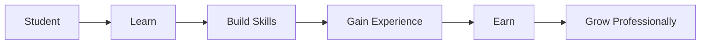

# 🚀 Campus Hustlers

<div align="center">


<br/>


</div>

---

## 🎯 Mission

Campus Hustlers is a student-first platform designed to bridge the gap between education and opportunity.

Our mission is to empower students to learn new skills, earn through real opportunities, build impactful projects, and prepare themselves for successful careers before graduation.

---

## 🌟 The Problem

Students often struggle with:

- Finding internships
- Getting practical experience
- Building professional networks
- Discovering freelance opportunities
- Participating in competitions
- Accessing career guidance

Most resources are scattered across multiple platforms.

---

## 💡 Our Solution

Campus Hustlers brings everything together in one ecosystem.

### Students can:

- 💼 Discover internships
- 💰 Find earning opportunities
- 🚀 Join startups
- 🏆 Participate in hackathons
- 📚 Learn industry-relevant skills
- 🤝 Connect with peers and mentors
- 🌐 Build professional portfolios
- 🎯 Prepare for careers

---

## 🚀 Features

### 💼 Opportunity Hub

- Internships
- Freelance Projects
- Campus Ambassador Programs
- Startup Opportunities
- Part-Time Work

### 🏆 Competitions

- Hackathons
- Coding Challenges
- AI/ML Competitions
- Innovation Challenges
- Startup Events

### 📚 Learning Center

- Career Roadmaps
- Learning Resources
- Technical Guides
- Industry Insights
- Skill Development Tracks

### 🌐 Community

- Student Networking
- Team Formation
- Project Collaboration
- Peer Learning
- Mentorship Access

### 📈 Career Growth

- Resume Building
- Portfolio Creation
- Interview Preparation
- Personal Branding
- Career Guidance

---

## 🎓 Target Audience

Campus Hustlers is built for:

- College Students
- Freshers
- Developers
- Designers
- Entrepreneurs
- AI/ML Enthusiasts
- Freelancers
- Startup Builders

---

## 🏗️ Platform Workflow



---

## 🔥 Why Campus Hustlers?

Unlike traditional job boards, Campus Hustlers focuses specifically on students.

We aim to create a complete ecosystem where students can:

- Learn
- Build
- Earn
- Network
- Grow

All from a single platform.

---

## 🛠️ Tech Stack

### Frontend

- React.js
- Next.js
- Tailwind CSS

### Backend

- Node.js
- Express.js

### Database

- MongoDB
- Firebase

### Future AI Integrations

- AI Career Assistant
- Smart Opportunity Recommendations
- Personalized Learning Paths
- Student Analytics Dashboard

---

## 📊 Roadmap

### Phase 1

- User Authentication
- Student Profiles
- Opportunity Listings

### Phase 2

- Community Features
- Project Collaboration
- Skill Tracking

### Phase 3

- AI Recommendations
- Career Assistant
- Smart Matching System

### Phase 4

- Startup Ecosystem
- Mentorship Network
- Scholarship Portal
- National Student Community

---

## 🤝 Contributing

Contributions are welcome!

```bash
Fork the repository
Create a feature branch
Commit your changes
Push your branch
Open a Pull Request
```

---

## 🌍 Vision

> Empowering students to transform their skills into opportunities and their ideas into impact.

---

## 👨‍💻 Founder

### Arnav Ranjan

AI Engineer | Full Stack Developer | Entrepreneur

- GitHub: https://github.com/arnavranjan50
- LinkedIn: https://linkedin.com/in/arnav-ranjan-972348207

---

<div align="center">

# 🚀 Learn. Earn. Build.

### The Future Belongs To Hustlers.

⭐ Star this repository if you support the vision.

</div>
